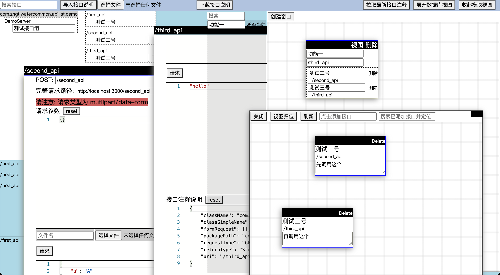

# SpringMVC_Apilist
该插件只适用于SpringMVC，其他webserver也能使用，但需要适配

多窗口，多组织方式的接口调试工具，可用于替代Swagger、PostMan

编辑器使用的是Monaco，可像vscode一样多行编辑，折叠等

接入方式：
```java
    @Bean
    public ServletRegistrationBean<HttpServlet> apilist() {
        Map<String, ApiInfo> map = new ApiListSpringResolve(
                Utils.asList("com.zhgt.watercommon.apilist.demo")
        ).getEndpoints();

        ApiManagement apiManagement = new ApiManagement("/apilist", map);

        // 若要使用数据库视图功能，则需要配置数据库信息，这里仅支持 mysql
//        MysqlDatabaseResolve databaseResolve =
//                new MysqlDatabaseResolve("localhost",
//                        3306,
//                        "dbname",
//                        "username",
//                        "123456");
//        ApiManagement.regisDbInfo(databaseResolve.getTableInfoMap());

        // 若是将接口描述信息存储在服务器上，则使用此处
        // 使用服务器，可以很方便多人共享接口信息
//       apiManagement.setRemoteServer(
//               "localhost",
//               8888);
// 
        // 将接口描述信息存储在本地
        apiManagement.usingLocalDB();

        return apiManagement.getServletRegistrationBean();
    }
```
然后启动项目访问 `http://your_project_host/apilist/index.html`

注意：如果你的SpringMVC有设置context path，那么访问 `http://your_project_host/<context path>/apilist/index.html`